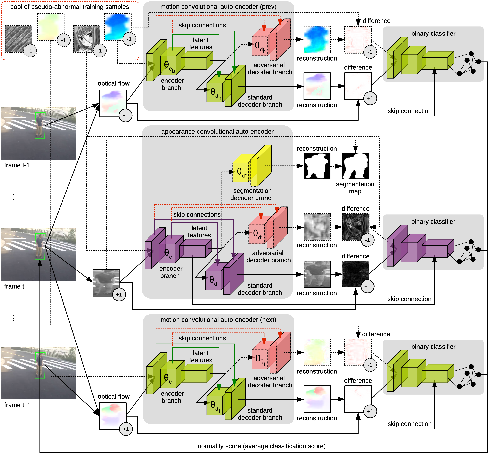

## A Background-Agnostic Framework with Adversarial Training for Abnormal Event Detection in Video
Mariana-Iuliana Georgescu, Radu Tudor Ionescu, Fahad Shahbaz Khan, Marius Popescu and Mubarak Shah
IEEE Transactions on Pattern Analysis and Machine Intelligence, 2021

Arxiv url: https://arxiv.org/abs/2008.12328

This is the official repository of "A Background-Agnostic Framework with Adversarial Training for Abnormal Event Detection in Video".

### In order to receive our code fill in this [form](./SecurifAI-form-and-license-PAMI-2021.pdf) and send a copy to georgescu_lily@yahoo.com and raducu.ionescu@gmail.com

### Short Abstract 
Our framework is composed of an object detector, a set of appearance and motion auto-encoders, and a set of classifiers.
Since our framework only looks at object detections, it can be applied to different scenes, provided that normal 
events are defined identically across scenes and that the single main factor of variation is the background. 
To overcome the lack of abnormal data during training, we propose an adversarial learning strategy for the auto-encoders. 
We create a scene-agnostic set of out-of-domain pseudo-abnormal examples, which are correctly reconstructed 
by the auto-encoders before applying gradient ascent on the pseudo-abnormal examples. 
We further utilize the pseudo-abnormal examples to serve as abnormal examples when training appearance-based 
and motion-based binary classifiers to discriminate between normal and abnormal latent features and reconstructions.

This is the pipeline of our framework:

Object reconstructions before and after adversarial training:

